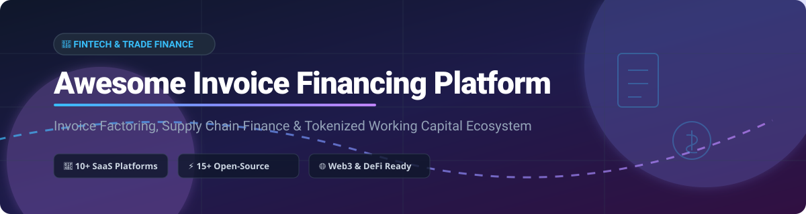

  

# 🚀 Awesome Invoice Financing Platform & Trade Finance Ecosystem

  
  
  
  

> 💡 A curated list of top SaaS products, B2B payment tools, and open-source GitHub projects for **Invoice Financing**, **Invoice Factoring**, **Supply Chain Finance (SCF)**, **Dynamic Discounting**, and **Trade Credit Optimization**.

📊 The global **Invoice Financing Platform Market** is estimated at **$24.25 Billion in 2026** (with total global factoring volume exceeding **$4.4 Trillion**). The sector is **moderately fragmented**, with the top 10 enterprise players controlling ~40% of market revenue, while agile fintech platforms and decentralized finance (DeFi) protocols compete to bridge the $1.7+ Trillion global trade finance gap.

---

## 📑 Table of Contents

- [🏢 SaaS & Enterprise Platforms](#-saas--enterprise-platforms)
- [💻 Open-Source GitHub Projects](#-open-source-github-projects)
- [⚙️ Key Features & Comparison](#%EF%B8%8F-key-features--comparison)
- [🤝 How to Contribute](#-how-to-contribute)
- [❤️ Support & Sponsorship](#%EF%B8%8F-support--sponsorship)
- [📈 Star History](#-star-history)
- [⚠️ Disclaimer](#%EF%B8%8F-disclaimer)

---

## 🏢 SaaS & Enterprise Platforms

Below is a curated summary of leading commercial invoice financing, enterprise supply chain finance, and B2B trade credit platforms, sorted by estimated company size (revenue / valuation descending).

| Platform | Estimated Size (Revenue / Valuation) | Pricing Model & Specific Starting Rates | Free Tier / Free Trial Limits | Key Capabilities |
| :--- | :--- | :--- | :--- | :--- |
| **Taulia** | **$1+ Trillion** annual processed volume | Starts at ~$500/month platform fee + 0.5%–1.5% APR early payment discount rate | No free tier; offers 30-day sandbox demo environment for enterprise buyers | Enterprise supply chain finance, dynamic discounting, SAP integration, and e-invoicing. |
| **C2FO** | **$2.73B** valuation / **$186M** annual revenue | Dynamic rate discounting starting at ~0.5% to 1.5% per invoice (supplier named rates) | Free registration & marketplace access; 0% fee until invoice early payment is cleared | World's largest working capital marketplace allowing suppliers to request early payment on chosen invoices. |
| **PrimeRevenue** | **$100M+** annual revenue | Enterprise annual license fee starting at ~$10,000/yr + 1.2%–2.8% APR funding margin | No free tier or public free trial; custom enterprise proof-of-concept (PoC) available upon request | Multi-funder supply chain finance programs for global enterprises across 80+ countries. |
| **TreviPay** | **$281M** annual revenue | Custom transaction fee starting at ~1.5% + $0.30 per transaction | No free tier; 14-day managed onboarding trial for approved merchant accounts | B2B payment network providing instant credit decisioning, net terms management, and receivables financing. |
| **Drip Capital** | **$428M+** total raised / Profitability reached | Invoice discounting rates starting at 0.8% to 1.5% per 30 days (up to 90% advance rate) | Free account signup & credit limit check; 0 fees until first invoice drawdown | Cross-border trade finance for SMB exporters with PO financing and collateral-free receivables funding. |
| **FundThrough** | **$100M–$500M** valuation / **$14.2M** revenue | Factoring fee starting at 1.9% to 2.9% per 30 days outstanding | Free account setup with no recurring fee; 100% free funding on first invoice up to $50,000 via QBO | Fast invoice factoring advancing funds on unpaid invoices within 24 hours with QBO/Xero integration. |
| **CredAble** | **$177M** valuation / **$3.5M** revenue | Platform transaction fee starting at 0.25% to 1% per financed invoice | Free platform access for suppliers; paid corporate host subscription with demo access | Indian & emerging market supply chain finance offering vendor financing, distributor credit, and fractional discounting. |
| **Balance** | **$56M+** funding raised | B2B checkout fee starting at 1.9% + $0.30 per trade transaction | Free test mode (sandbox environment) with unlimited test API transactions | Embedded B2B Buy Now Pay Later (BNPL) checkout financing instant payouts for sellers while extending 30-90 day net terms. |
| **Resolve** | **$25M+** funding raised | Advanced credit net terms starting at 2.6% per 30-day funded invoice | 30-day free trial on standard credit management software; limits up to 10 buyer credit checks | B2B credit-as-a-service providing automated buyer credit checks, net 30/60/90 terms, and advance payouts. |
| **MarketFinance** | **$1M–$10M** annual revenue | Confidential invoice discounting starting at 0.75% to 1.5% fee per invoice | Free account registration; no commitment or minimum monthly fee required | UK business finance platform providing revolving credit lines and selective invoice discounting. |

---

## 💻 Open-Source GitHub Projects

Curated open-source projects for self-hosting invoicing engines, web3 invoice tokenization, decentralized supply chain financing, and accounting foundations, sorted by GitHub_Stars_Count (descending).

| Project | GitHub_Stars_Badge | Core Architecture | Description |
| :--- | :--- | :--- | :--- |
| **Midday** |  | Next.js, TypeScript, Tailwind | All-in-one financial OS for freelancers and SMBs with automated invoice generation, time tracking, and financial reconciliation. |
| **Aureus ERP** |  | Python, JavaScript | Open-source enterprise resource planning engine featuring sales invoice workflows, customer accounts, and supply chain ledger. |
| **Invoice Ninja** |  | Laravel (PHP), Flutter | Self-hosted invoicing, payment gateway integration, quote generation, and recurring invoice management platform. |
| **IDURAR ERP CRM** |  | Node.js, React, MongoDB | Modern ERP & CRM system tailored for managing sales invoices, payments, quotes, and customer accounts. |
| **Crater Invoice** |  | PHP, Vue.js | Open-source invoice app designed for small businesses to track payments, create professional PDF invoices, and record expenses. |
| **Dolibarr ERP CRM** |  | PHP, MySQL | Comprehensive business suite providing invoice management, supplier orders, inventory control, and trade finance record-keeping. |
| **Manta** |  | Electron, React | Desktop invoicing application with customizable templates and local encrypted data storage for independent trade contractors. |
| **Kimai** |  | Symfony (PHP), MySQL | Multi-user time tracking and invoice generation software for tracking billable hours and exportable financial statements. |
| **Frappe Books** |  | Electron, Vue.js, Python | Free desktop accounting app for small businesses featuring double-entry ledger, sales invoices, and customer statements. |
| **GnuCash** |  | C, C++, Scheme | Personal and small-business financial accounting software with invoice processing, receivables tracking, and tax reports. |
| **InvoicePlane** |  | PHP, MySQL | Self-hosted invoicing system for managing quotes, client credit, payments, and custom invoice templates. |
| **SolidInvoice** |  | Symfony (PHP) | Open-source invoicing application for small businesses and freelancers with REST API and automated payment collection. |
| **InvoFi (Stellar)** |  | Rust, Soroban, Stellar | Decentralized invoice financing protocol on Stellar enable SMEs to tokenize invoices as real-world assets (RWA) for USDC liquidity pools. |
| **InvoX Platform** |  | Solidity, React, Node.js | Blockchain-based invoice financing & factoring registry featuring AI-assisted risk negotiation, KYC verification, and dynamic credit scoring. |
| **SCF Thesis Contracts** |  | Solidity, Hardhat | Smart contract framework supporting purchase order financing, invoice discounting, and reverse securitization pipelines. |
| **Supply Chain Finance (R01)** |  | Ethereum, React, Plaid | ERC-721 invoice tokenization dapp featuring automated smart contract settlement and Plaid banking integration. |

---

## ⚙️ Key Features & Comparison

When evaluating invoice financing platforms or open-source trade credit modules, consider the following dimensions:

1. 💵 **Advance Rate:** Traditional factoring advances 80%–95% of invoice face value immediately, releasing the remaining balance (minus fees) upon customer payment.
2. 🛡️ **Recourse vs. Non-Recourse:** Non-recourse financing protects the supplier if the debtor defaults, whereas recourse financing requires the supplier to buy back unpaid invoices.
3. 🔄 **ERP & Accounting Integration:** Direct API synchronization with platforms like SAP, Oracle NetSuite, QuickBooks Online, or Xero automates invoice verification and reconciliation.
4. 🔗 **On-Chain Tokenization (DeFi):** Tokenizing invoices into ERC-721 or Stellar Soroban tokens unlocks global liquidity pools and transparent smart contract settlement.

---

## 🤝 How to Contribute

Contributions are welcome! To submit a new platform or open-source tool:

1. 🍴 Fork the repository.
2. 📝 Add your entry into `README.md` following the exact table structure.
3. 🔍 Provide accurate pricing, funding, or repository star information.
4. 🚀 Submit a Pull Request (PR) with a brief summary of the added solution.

---

## ❤️ Support & Sponsorship

Thank you for exploring and supporting the **Awesome Invoice Financing Platform** ecosystem! If you find this curated reference valuable for your fintech research, project builds, or business operations, please consider supporting the project:

- ⭐ **Star** this repository on GitHub to increase its visibility.
- 🔀 **Fork** and share it with fellow developers, trade finance professionals, and fintech enthusiasts.
- ☕ **Buy a coffee / Sponsor** the author via the [GitHub Sponsor Dashboard](https://github.com/sponsors/ishandutta2007).

---

## 📈 Star History

---

## ⚠️ Disclaimer

*This repository is for informational and educational purposes only and does not constitute financial advice. Invoice financing involves credit risk, financial compliance (AML/KYC), and regulatory frameworks. Smart contracts and open-source software should be thoroughly audited before deployment in live production environments.*
